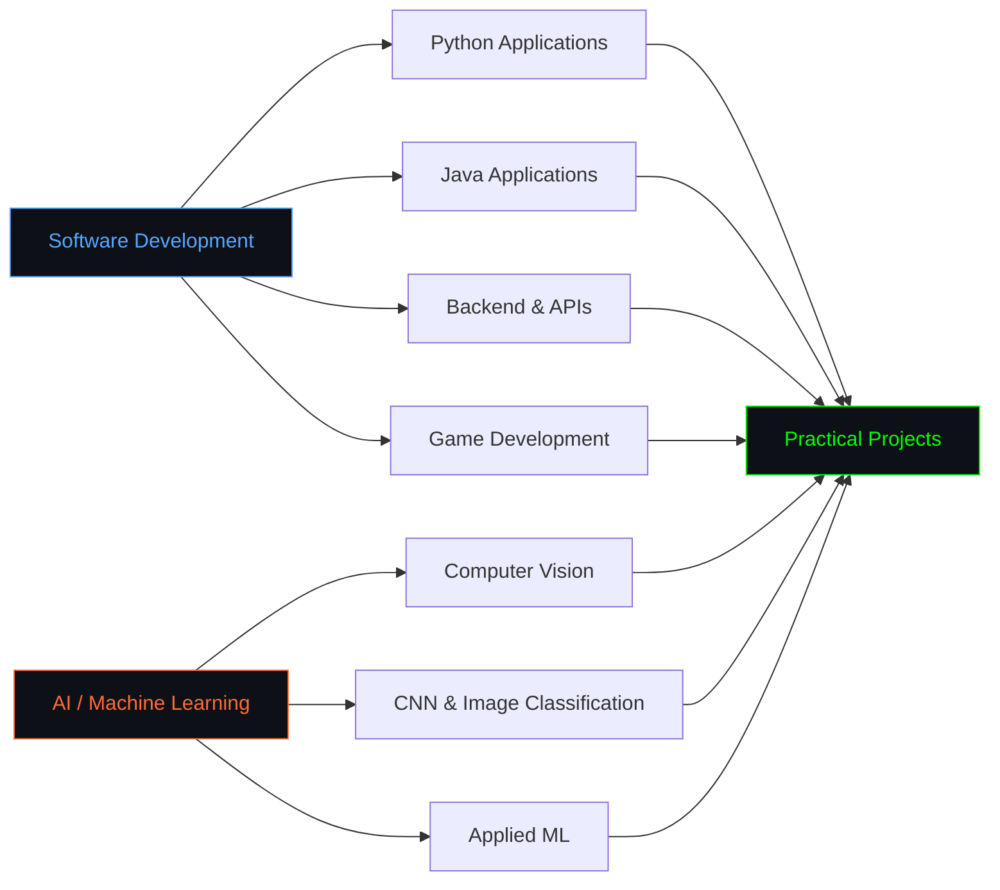

<div align="center">

<p align="center">
  
</p>


</div>


#### About Me:

``` python
class Human:
    def __init__(self):
        self.name = "Human"
        self.username = "MMOSHII"
        self.focus = [
            "Artificial Intelligence",
            "Software Development",
            "Computer Vision",
            "Backend & API Development"
        ]
        self.languages = ["Python", "Java", "Jupyter Notebook"]

    def philosophy(self):
        return "Build it. Break it. Understand it. Make it better."

me = Human()
```

<p align="justify">
I'm Human (@MMOSHII), a developer who enjoys turning ideas into working software.
My projects explore AI/ML, computer vision, APIs, application development, and game development. I prefer learning through implementation: build something, discover what breaks, understand why it breaks, and then make the system less terrible.
</p>


<div align="center">

## Tech Stack


</div>


<div align="center">

## Focus Areas

</div>




<div align="center">

## Open to Collaboration

<table width="100%">
<tr>
  <td align="center" width="25%" valign="top">
    
    <br><br>
    <strong>Software Development</strong>
    <br><br>
    <small>
      Application Development<br>
      Backend & APIs<br>
      Practical Software Projects
    </small>
  </td>

  <td align="center" width="25%" valign="top">
    
    <br><br>
    <strong>AI / ML</strong>
    <br><br>
    <small>
      Computer Vision<br>
      CNN & Image Classification<br>
      Applied Machine Learning
    </small>
  </td>

  <td align="center" width="25%" valign="top">
    
    <br><br>
    <strong>Game Development</strong>
    <br><br>
    <small>
      PyGame Projects<br>
      Interactive Applications<br>
      Experimental Development
    </small>
  </td>

  <td align="center" width="25%" valign="top">
    
    <br><br>
    <strong>Open Source</strong>
    <br><br>
    <small>
      Personal Projects<br>
      Collaboration<br>
      Developer Learning
    </small>
  </td>
</tr>
</table>

</div>

<!-- 

<div align="center">

## GitHub Activity

<picture>
  <source media="(prefers-color-scheme: dark)" srcset="https://github-readme-activity-graph.vercel.app/graph?username=MMOSHII&theme=tokyo-night&hide_border=true&bg_color=0D1117&color=00D9FF&line=00D9FF&point=FF6B35&area=true"/>
  
</picture>

<br><br>

<picture>
  <source media="(prefers-color-scheme: dark)" srcset="https://github-readme-stats.vercel.app/api?username=MMOSHII&show_icons=true&include_all_commits=true&theme=tokyonight&hide_border=true&bg_color=0D1117&title_color=00D9FF&text_color=FFFFFF&icon_color=FF6B35"/>
  
</picture>

<picture>
  <source media="(prefers-color-scheme: dark)" srcset="https://github-readme-stats.vercel.app/api/top-langs/?username=MMOSHII&layout=compact&theme=tokyonight&hide_border=true&bg_color=0D1117&title_color=00D9FF&text_color=FFFFFF&langs_count=10"/>
  
</picture>

</div> -->


<div align="center">

## Connect

<i>"Building practical systems, one project at a time."</i>

[](https://www.linkedin.com/in/achmad-hadi-rasyid/)
[](mailto:achmadhadirasyid@gmail.com)
[](https://mmoshii.github.io/)
[](https://www.instagram.com/shiao_11421/)


</div>
